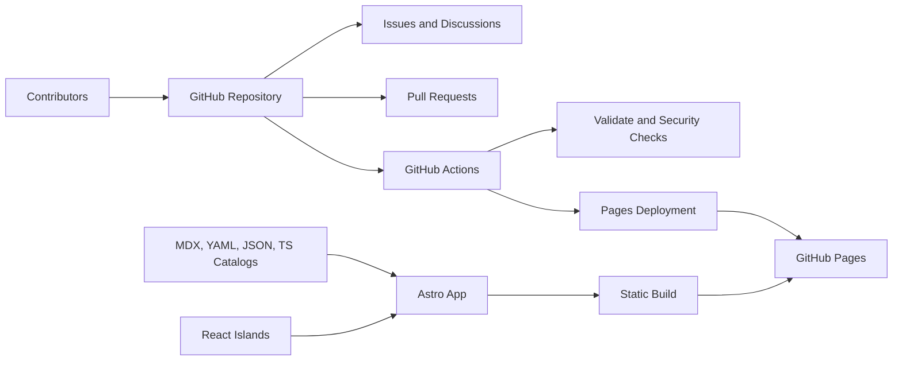

# AIByDM Architecture

AIByDM is a static-first open-source platform designed for learner clarity, contributor velocity,
and low-friction deployment.

## Architecture Principles

- Prefer static delivery for reliability and simplicity.
- Use interactivity where it improves learning, not by default.
- Keep content in-repo so contributors can improve it through normal Git workflows.
- Treat documentation and community operations as part of the system architecture.

## System Overview

## Core Layers

| Layer               | Responsibility                                                    |
| ------------------- | ----------------------------------------------------------------- |
| Astro routes        | Static shell, page composition, metadata, and route generation    |
| React islands       | Search, progress tracking, and interactive product surfaces       |
| Content collections | Learning lessons, tools, exams, games, and newsletter entries     |
| TypeScript catalogs | Structured learning roadmaps, stage metadata, and search indexes  |
| GitHub workflows    | Validation, deployment, security scanning, and release automation |
| Community docs      | Contribution flow, support, governance, and roadmap communication |

## Repository Map

| Path              | Role                                                  |
| ----------------- | ----------------------------------------------------- |
| `src/pages/`      | User-facing routes                                    |
| `src/components/` | Astro and React UI building blocks                    |
| `src/content/`    | Authored platform content                             |
| `src/data/`       | Structured catalog and search data                    |
| `src/styles/`     | Global tokens and styling primitives                  |
| `.github/`        | Automation, templates, and repository operations      |
| `docs/`           | Public documentation for contributors and maintainers |

## Detailed Architecture Docs

The long-form architecture pack lives in [docs/architecture/README.md](./docs/architecture/README.md).
It includes product requirements, information architecture, design system notes, deployment, search,
content architecture, and implementation planning.
