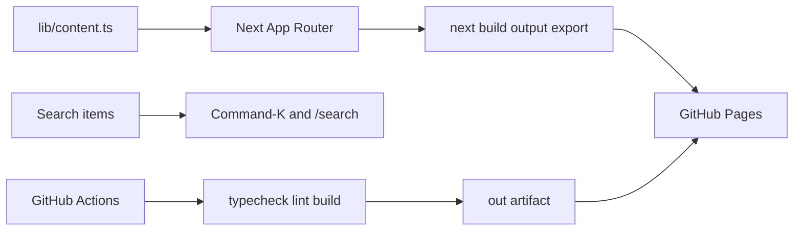

# AIByDM Architecture

AIByDM is a static-first Next.js App Router platform for AI learning, discovery, practice, exam preparation, newsletter reading, and community contribution.

## Principles

- Keep the public product static-export compatible for GitHub Pages.
- Put each major area behind a clear landing page and dedicated detail routes.
- Model content with typed TypeScript objects and explicit slugs.
- Keep learning progression simple: track, module, lesson, project.
- Prefer shared navigation, footer, hero, card, button, and search patterns over page-specific templates.
- Respect reduced motion, keyboard navigation, visible focus, and small-screen constraints.

## Runtime Model



## Product Areas

| Area | Route | Detail routes |
| --- | --- | --- |
| Learn | `/learn/` | `/learn/[slug]/`, `/learn/[slug]/[lessonSlug]/`, `/learn/[slug]/projects/[projectSlug]/` |
| Tools | `/tools/` | `/tools/[slug]/` |
| Games | `/games/` | `/games/[slug]/` |
| Exams | `/exams/` | `/exams/[slug]/` |
| Newsletter | `/newsletter/` | `/newsletter/[slug]/` |
| Community | `/community/` | GitHub links for discussions, issues, security, and support |
| Search | `/search/` | Client-side query and type filters |

## Content Model

`lib/content.ts` defines the public content contracts:

- `Track`, `Module`, `Lesson`, `Project`
- `ToolCategory`, `Tool`
- `Game`
- `Exam`
- `Issue`
- `SearchItem`

Every route uses explicit slugs. Production URLs are not derived from mutable titles.

Route helpers live alongside the data:

- `getTrackHref`
- `getLessonHref`
- `getProjectHref`
- `getToolHref`
- `getGameHref`
- `getExamHref`
- `getIssueHref`

## Static Export

`next.config.mjs` keeps the site GitHub Pages-ready:

```js
const nextConfig = {
  output: 'export',
  trailingSlash: true,
  basePath: process.env.BASE_PATH ?? '/AIByDM',
  images: {
    unoptimized: true,
  },
};
```

Avoid features that require a Next server, including server actions, dynamic server routes, image optimization, and database-backed search.

## Quality Gates

Local and CI validation use the same commands:

```bash
npm run typecheck
npm run lint
npm run build
```

The GitHub Pages workflow uploads the generated `out/` directory.
