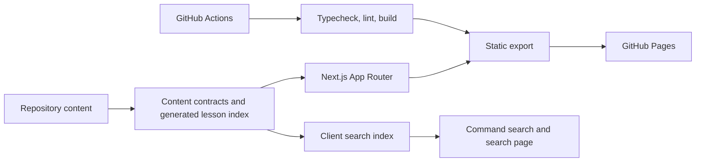
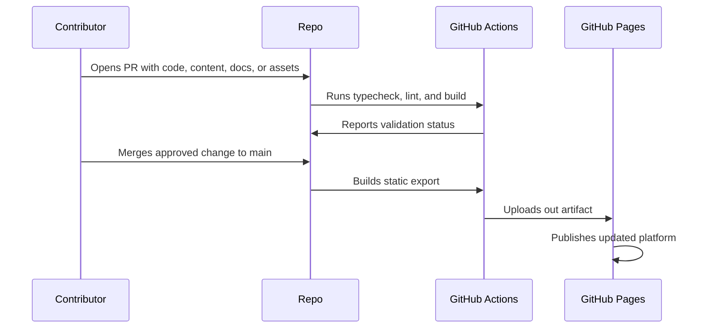

# AIByDM Architecture

AIByDM is a static-first Next.js App Router platform for AI learning, discovery, practice, exam preparation, newsletter reading, and community contribution.

## Principles

- Keep the public product static-export compatible for GitHub Pages.
- Put each major area behind a clear landing page and dedicated detail routes.
- Model content with typed TypeScript objects and generated JSON lesson data.
- Keep learning progression understandable: track, phase, lesson, project, practice, exam.
- Prefer shared navigation, footer, hero, card, button, and search patterns over page-specific one-offs.
- Respect reduced motion, keyboard navigation, visible focus, and small-screen constraints.

## System Overview



## Product Architecture

| Area | Routes | Responsibility |
| --- | --- | --- |
| Frontend shell | `app/`, `components/site/` | Navigation, layout, footer, global search, responsive structure. |
| Learning system | `app/learn/`, `components/learn/`, `lib/learning.ts` | Tracks, phases, lessons, projects, and learner progress controls. |
| Content system | `lib/content.ts`, `lib/generated/` | Typed catalogs, generated lesson metadata, route helpers, and search data. |
| Progress tracking | `hooks/use-learn-progress.ts` | Client-side learning state for local progress and completion flows. |
| Exam engine | `app/exams/`, content catalogs | Role-based preparation pages, questions, explanations, and readiness flows. |
| Tools platform | `app/tools/`, `components/tools/` | Searchable AI tool discovery and detail pages. |
| Games platform | `app/games/` | Practice loops connected to learning objectives. |
| Newsletter | `app/newsletter/` | Editorial updates, release signal, and project communication. |
| Community | `app/community/`, repository docs | Contributor paths, support, governance, and discussions. |
| Deployment | `.github/workflows/`, `next.config.mjs` | Static export validation and GitHub Pages publishing. |

## Static Export and GitHub Pages

`next.config.mjs` keeps the site deployable without a long-running server:

```js
const nextConfig = {
  output: 'export',
  trailingSlash: true,
  basePath: process.env.BASE_PATH ?? '/AIByDM',
  images: {
    unoptimized: true,
  },
};
```

Avoid features that require a Next.js server runtime, including server actions, dynamic server routes, image optimization, database-backed search, and authenticated API routes.

## Data Flow



## Quality Gates

Run the same checks locally and in CI:

```bash
npm run typecheck
npm run lint
npm run build
```

## Deeper Docs

- [docs/architecture/README.md](./docs/architecture/README.md)
- [docs/content-system/README.md](./docs/content-system/README.md)
- [docs/development/README.md](./docs/development/README.md)
- [docs/deployment/README.md](./docs/deployment/README.md)
