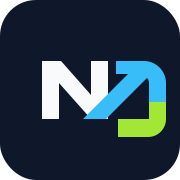

# AIByDM

**Learn AI. Build AI. Master AI.**

An open-source AI learning platform for structured courses, hands-on projects, curated AI tools, practice games, exam preparation, newsletters, and community-led learning.

[](https://dipakmandlik.github.io/AIByDM/)
[](./docs/README.md)
[](./ROADMAP.md)
[](./CONTRIBUTING.md)
[](https://github.com/DipakMandlik/AIByDM/discussions)
[](./COMMUNITY.md#discord-future)

[](https://github.com/DipakMandlik/AIByDM/actions/workflows/validate.yml)
[](https://github.com/DipakMandlik/AIByDM/actions/workflows/deploy.yml)
[](./LICENSE)
[](https://github.com/DipakMandlik/AIByDM/graphs/contributors)
[](https://github.com/DipakMandlik/AIByDM/issues)
[](https://github.com/DipakMandlik/AIByDM/pulls)
[](https://github.com/DipakMandlik/AIByDM/commits/main/)
[](https://github.com/DipakMandlik/AIByDM/releases)
[](https://github.com/DipakMandlik/AIByDM/stargazers)
[](https://github.com/DipakMandlik/AIByDM/forks)

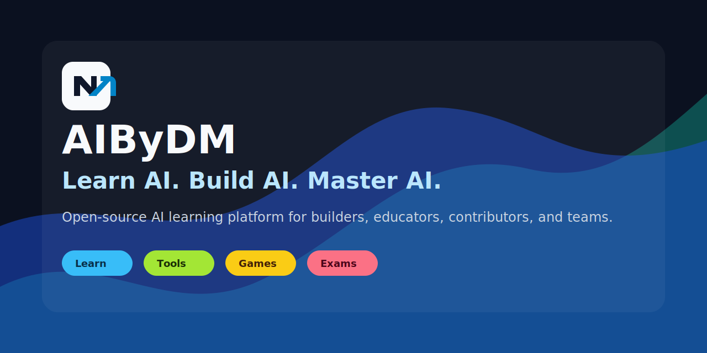

## Mission

AIByDM exists because AI education is scattered across tutorials, tools, courses, papers, prompts, and disconnected demos. Builders need one open, practical place to learn the concepts, compare the tools, practice the workflows, prepare for interviews, and contribute improvements back to the community.

The project is built in public so learners can become contributors, contributors can become maintainers, and the platform can evolve with the AI engineering ecosystem.

## Platform Overview

| Area | What it solves | Start here |
| --- | --- | --- |
| Learn | Structured AI learning paths from foundations to production AI systems. | [Open Learn](https://dipakmandlik.github.io/AIByDM/learn/) |
| AI From Scratch | Deep curriculum for math, ML, deep learning, transformers, agents, safety, and infrastructure. | [Open AI From Scratch](https://dipakmandlik.github.io/AIByDM/learn/ai-from-scratch/) |
| Tools | Curated AI tools with use cases, categories, pricing notes, and alternatives. | [Browse Tools](https://dipakmandlik.github.io/AIByDM/tools/) |
| Games | Focused practice loops that turn concepts into repeatable drills. | [Play Games](https://dipakmandlik.github.io/AIByDM/games/) |
| Exams | Role-based preparation for AI builders, product leaders, and prompt engineers. | [Prepare for Exams](https://dipakmandlik.github.io/AIByDM/exams/) |
| Newsletter | Editorial updates, release notes, and AI learning signal. | [Read Newsletter](https://dipakmandlik.github.io/AIByDM/newsletter/) |
| Community | Issues, discussions, contribution lanes, recognition, and governance. | [Join Community](./COMMUNITY.md) |

## Feature Highlights

- Structured learning paths with lessons, phases, projects, and topic metadata.
- AI From Scratch curriculum covering foundations, transformers, agents, tools, safety, production, and capstones.
- Searchable AI tools directory for practical discovery and comparison.
- Games and exams that reinforce learning through active practice.
- GitHub Pages deployment with static export, no backend requirement, and contributor-friendly workflows.
- Open-source operations: issue templates, discussions, PR templates, release workflow, security policy, and public roadmap.

## Screenshots

| Homepage | Learn |
| --- | --- |
| 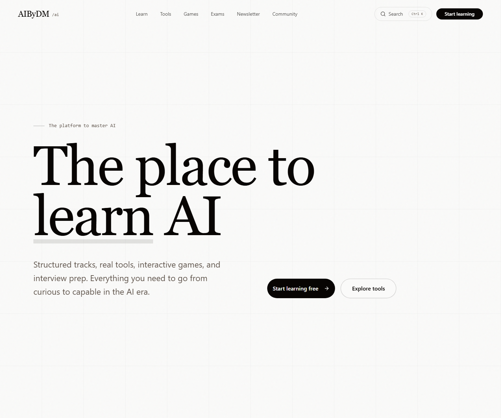 | 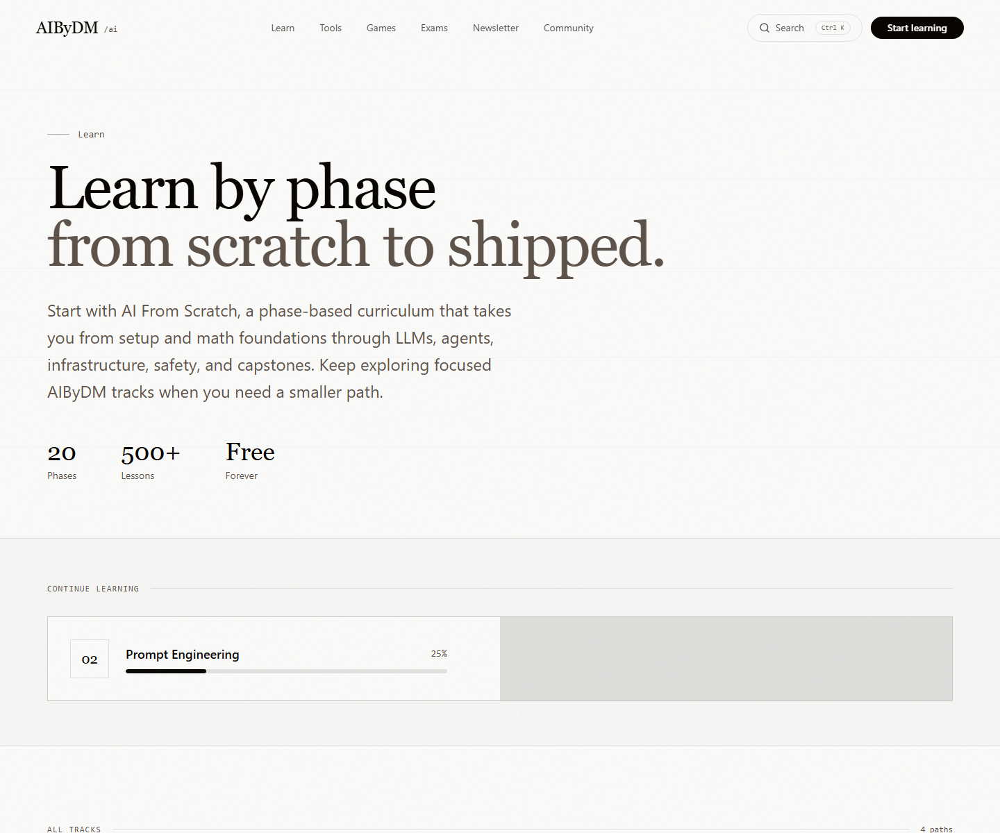 |
| Clear product positioning and platform entry points. | Structured paths for AI learning and project progression. |

| AI From Scratch | Tools |
| --- | --- |
| 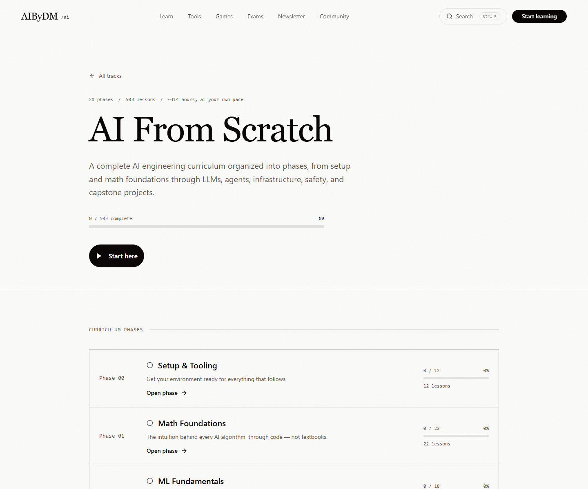 | 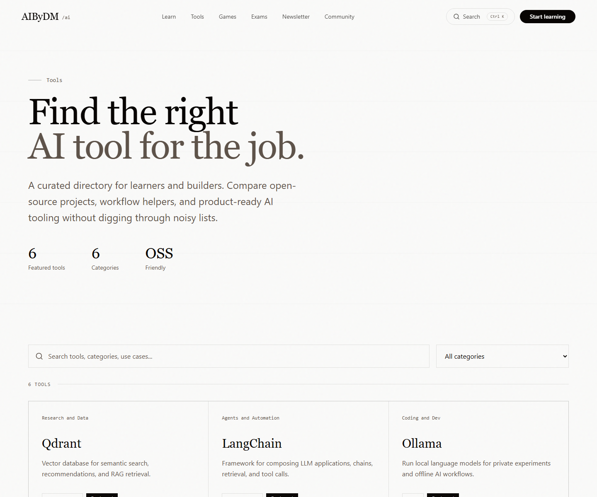 |
| Deep curriculum from setup through capstone projects. | Curated discovery for AI engineering stacks. |

| Games | Exams |
| --- | --- |
| 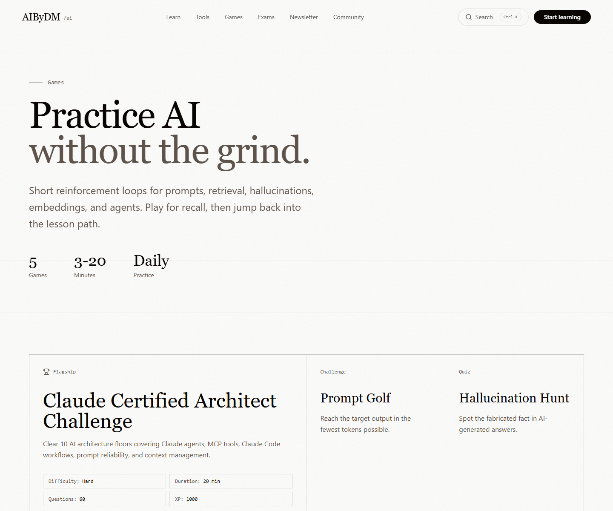 | 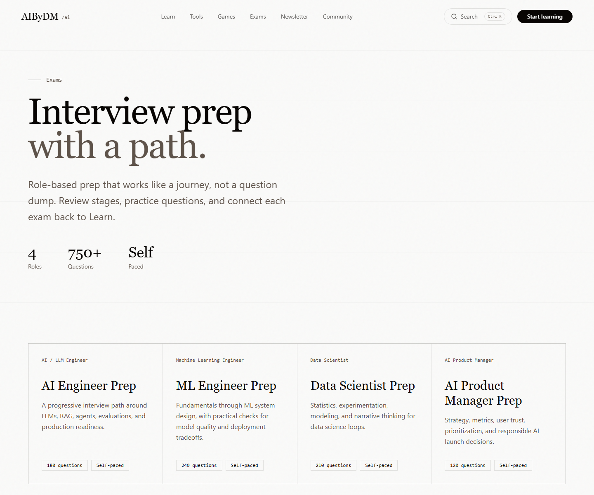 |
| Short practice loops for recall and applied learning. | Role-based preparation paths and readiness checks. |

| Newsletter | Mobile Home |
| --- | --- |
| 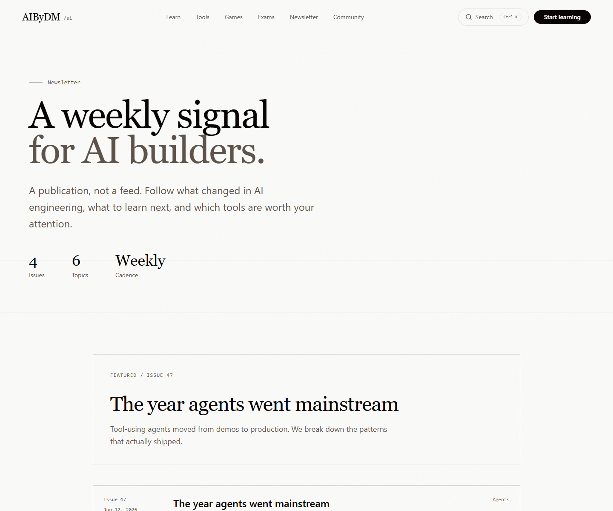 | 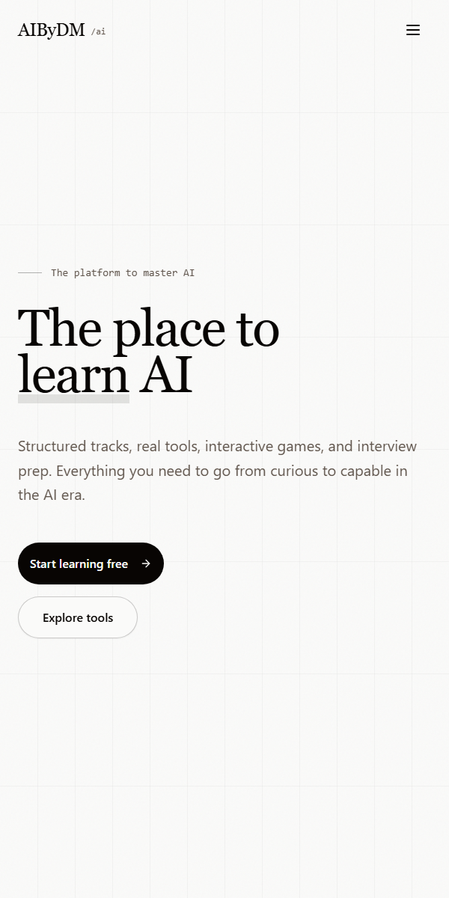 |
| Project signal and AI learning updates. | Responsive platform access for learners on the go. |

Additional visual QA assets: [Mobile Learn](./assets/screenshots/mobile-learn.png), [Light Mode](./assets/screenshots/light-mode.png), and [Dark Mode](./assets/screenshots/dark-mode.png).

## Watch Demo

The repository is prepared for product demo assets under [assets/demo](./assets/demo/).

| Demo asset | Status | Path |
| --- | --- | --- |
| Product Demo | Placeholder ready | [assets/demo/README.md](./assets/demo/README.md) |
| Feature Walkthrough | Script and shot list ready | [docs/marketing/LAUNCH_VIDEO_KIT.md](./docs/marketing/LAUNCH_VIDEO_KIT.md) |
| Learning Experience Demo | Capture path defined | [docs/marketing/launch-video-shotlist.json](./docs/marketing/launch-video-shotlist.json) |
| Preview GIF | Add when recorded | `assets/demo/aibydm-demo-preview.gif` |
| YouTube Link | Add when published | README demo section |
| Downloadable Version | Add when exported | `assets/demo/aibydm-platform-walkthrough.mp4` |

## Architecture

AIByDM is a static-first Next.js platform designed for GitHub Pages.

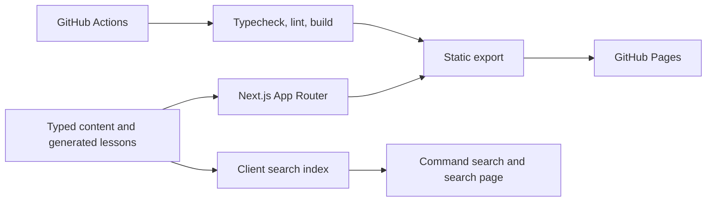

Read the full architecture notes in [ARCHITECTURE.md](./ARCHITECTURE.md) and [docs/architecture/README.md](./docs/architecture/README.md).

## Tech Stack

| Layer | Technology |
| --- | --- |
| Framework | Next.js App Router static export |
| UI | React 19, TypeScript |
| Styling | Tailwind CSS 4 |
| Icons | Lucide React |
| Content | TypeScript catalogs and generated JSON lesson data |
| Search | Client-side index and command search |
| Analytics | Vercel Analytics |
| Hosting | GitHub Pages |
| CI/CD | GitHub Actions |
| Package manager | npm |

## Installation

Prerequisites: Node.js `22.12.0+` and npm `10+`.

```bash
git clone https://github.com/DipakMandlik/AIByDM.git
cd AIByDM
npm install
```

## Development

```bash
npm run dev
```

The local app uses the GitHub Pages base path by default: `http://localhost:3000/AIByDM/`.

| Command | Purpose |
| --- | --- |
| `npm run dev` | Start the local Next.js dev server. |
| `npm run typecheck` | Run TypeScript validation. |
| `npm run lint` | Run ESLint. |
| `npm run build` | Build the static export into `out/`. |

## Deployment

AIByDM deploys to GitHub Pages through GitHub Actions. Push to `main`, let validation run, upload the generated `out/` artifact, and GitHub Pages serves the site at <https://dipakmandlik.github.io/AIByDM/>.

Deployment details: [docs/deployment/README.md](./docs/deployment/README.md).

## Roadmap

| Phase | Focus | Status |
| --- | --- | --- |
| Phase 1 | AI Learning Platform | Active |
| Phase 2 | Tools Directory | Active |
| Phase 3 | Games Platform | Active |
| Phase 4 | Certification Center | Planned |
| Phase 5 | Newsletter | Active |
| Phase 6 | Community | Next |
| Phase 7 | AI Tutor | Planned |
| Phase 8 | Interactive Labs | Planned |
| Phase 9 | Enterprise Academy | Future |

See [ROADMAP.md](./ROADMAP.md) for milestones, contributor opportunities, and sequencing.

## Contributing

AIByDM is designed for contributors across product, content, engineering, design, education, and community operations.

- Start with [CONTRIBUTING.md](./CONTRIBUTING.md).
- Browse [good first issue guidance](./docs/community/GOOD_FIRST_ISSUES.md).
- Use [GitHub Issues](https://github.com/DipakMandlik/AIByDM/issues/new/choose) for scoped work.
- Use [GitHub Discussions](https://github.com/DipakMandlik/AIByDM/discussions) for ideas, questions, and collaboration.
- Read [COMMUNITY.md](./COMMUNITY.md) for recognition, support, and contributor paths.

Before opening a pull request, run `npm run typecheck`, `npm run lint`, and `npm run build`.

## Community

AIByDM is not just a codebase. It is a public learning ecosystem for AI builders.

- Community hub: [COMMUNITY.md](./COMMUNITY.md)
- Support: [SUPPORT.md](./SUPPORT.md)
- Security: [SECURITY.md](./SECURITY.md)
- Code of conduct: [CODE_OF_CONDUCT.md](./CODE_OF_CONDUCT.md)
- Maintainers: [MAINTAINERS.md](./MAINTAINERS.md)
- Contributor recognition: [docs/community/CONTRIBUTOR_RECOGNITION.md](./docs/community/CONTRIBUTOR_RECOGNITION.md)

## Why Star AIByDM

Starring the repository helps learners discover a practical AI curriculum, helps contributors find a meaningful open-source project, and helps the platform attract reviewers, educators, and maintainers.

## Sponsors

Sponsorship support helps sustain curriculum writing, platform polish, visual assets, release operations, and contributor onboarding.

- GitHub Sponsors: [github.com/sponsors/DipakMandlik](https://github.com/sponsors/DipakMandlik)
- Funding configuration: [.github/FUNDING.yml](./.github/FUNDING.yml)

## Release

The first official foundation release is documented as [v0.1.0 - AIByDM Platform Foundation](./RELEASES.md#v010---aibydm-platform-foundation).

- Changelog: [CHANGELOG.md](./CHANGELOG.md)
- Release process: [RELEASES.md](./RELEASES.md)
- GitHub release workflow: [.github/workflows/release.yml](./.github/workflows/release.yml)

## License

AIByDM is released under the [MIT License](./LICENSE).

## Acknowledgements

AIByDM builds on the work of the open-source education, AI engineering, and web platform communities, including Next.js, React, Tailwind CSS, Lucide, GitHub Pages, and the many learners and builders sharing practical AI knowledge in public.
