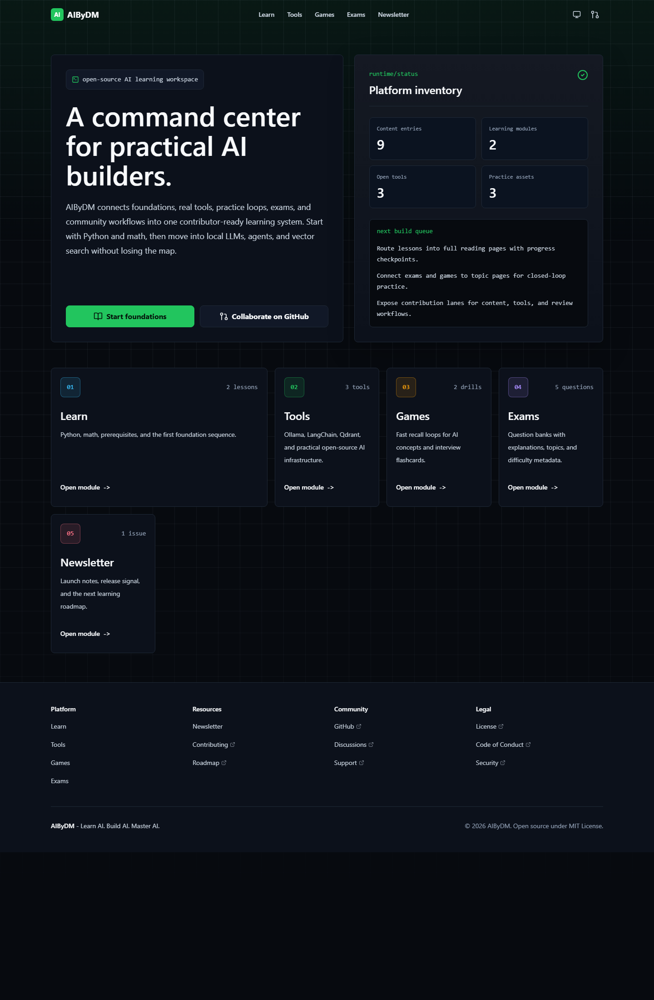
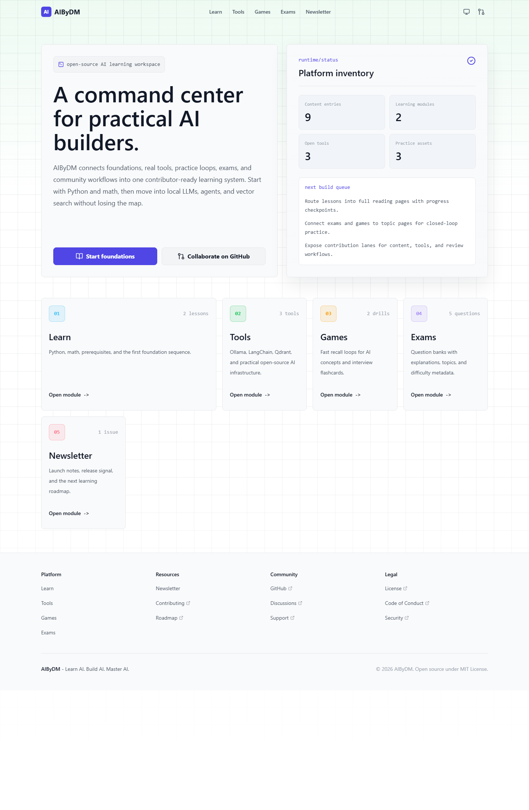
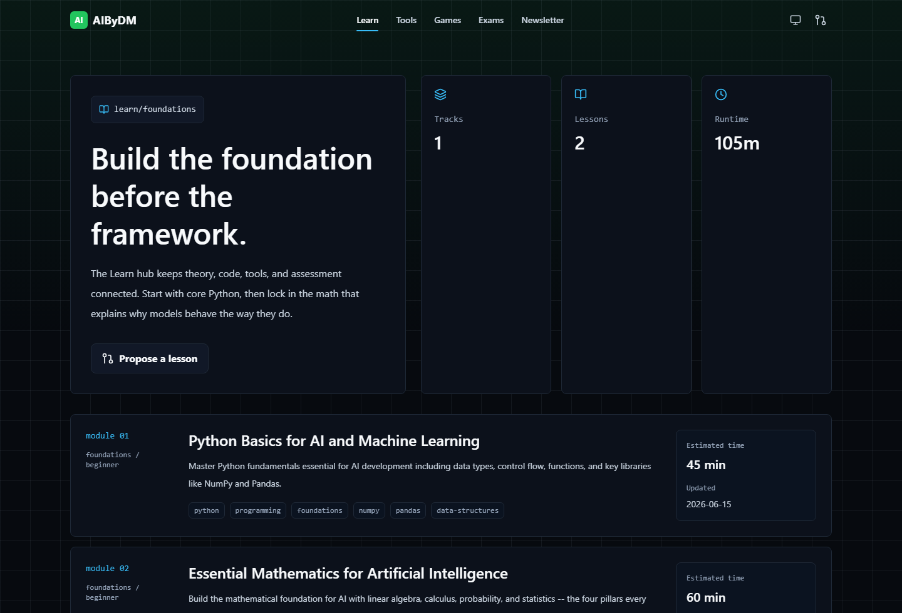
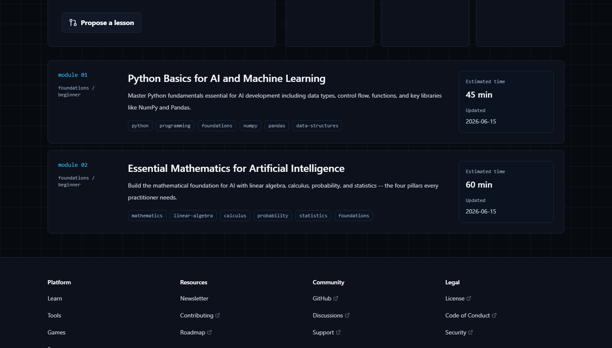
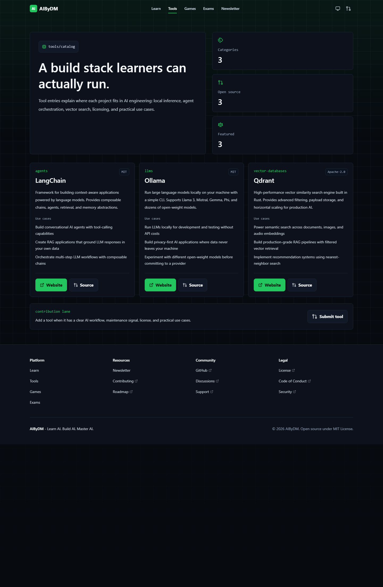
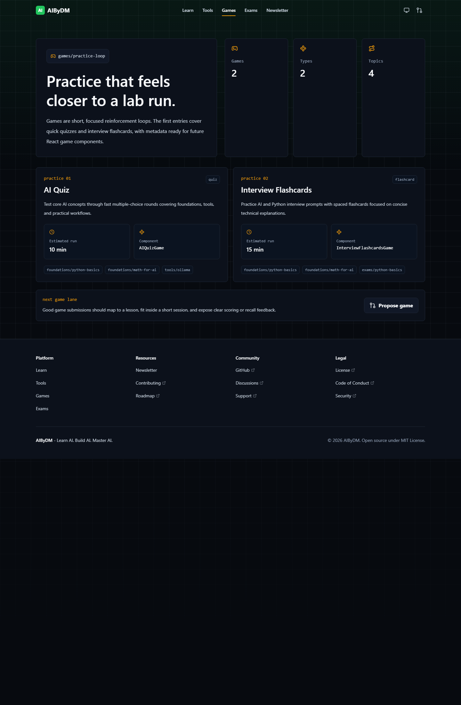
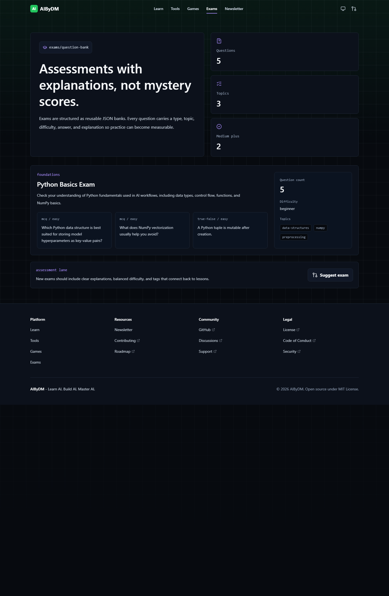
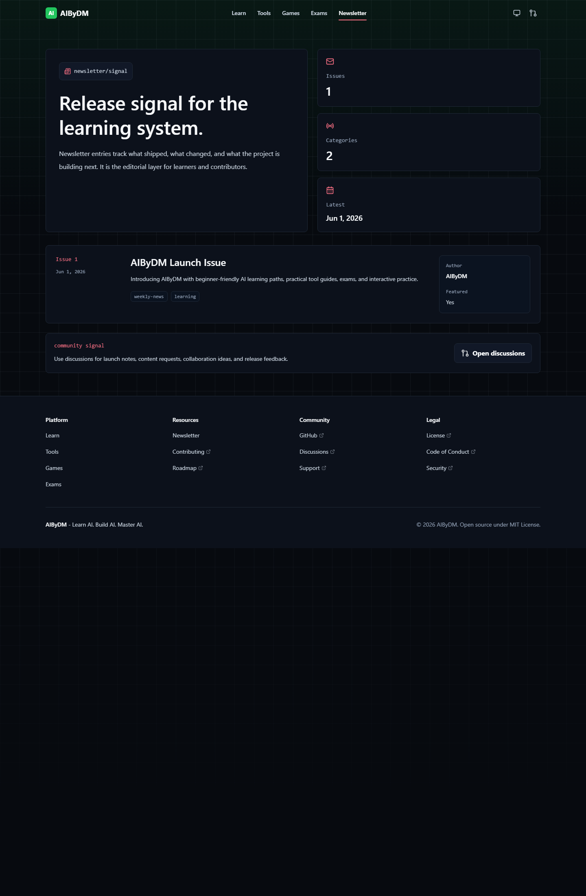
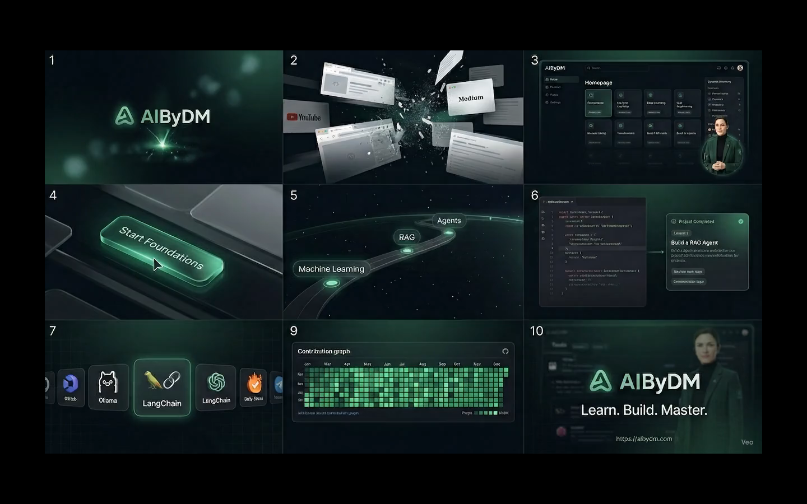

<p align="center">
  
</p>

<h1 align="center">AIByDM</h1>

<p align="center">
  <strong>Learn AI. Build AI. Master AI.</strong>
</p>

<p align="center">
  Open-source AI learning platform featuring structured learning paths, projects, roadmaps,
  AI tools, challenges, exams, and community-driven learning.
</p>

<p align="center">
  <a href="https://dipakmandlik.github.io/AIByDM/"></a>
  <a href="./docs/README.md"></a>
  <a href="./ROADMAP.md"></a>
  <a href="./CONTRIBUTING.md"></a>
  <a href="./COMMUNITY.md"></a>
</p>

<p align="center">
  <a href="https://github.com/DipakMandlik/AIByDM/actions/workflows/validate.yml"></a>
  <a href="https://github.com/DipakMandlik/AIByDM/actions/workflows/deploy.yml"></a>
  <a href="./LICENSE"></a>
  <a href="https://github.com/DipakMandlik/AIByDM/stargazers"></a>
  <a href="https://github.com/DipakMandlik/AIByDM/graphs/contributors"></a>
  <a href="https://github.com/DipakMandlik/AIByDM/issues"></a>
  <a href="https://github.com/DipakMandlik/AIByDM/pulls"></a>
  <a href="https://github.com/DipakMandlik/AIByDM/commits/main/"></a>
  <a href="https://dipakmandlik.github.io/AIByDM/"></a>
</p>

<p align="center">
  
</p>

## Why AIByDM Exists

AI learning is still fragmented. Tutorials live in one place, tools in another, interview prep in a
third, and contributor workflows are usually missing altogether.

AIByDM brings those pieces into one open-source system:

- A structured curriculum for builders who want more than scattered bookmarks.
- Real tool context so learners understand where local LLMs, orchestration frameworks, and vector
  databases fit.
- Practice loops through games, assessments, and guided progression.
- A repository that is ready for contributors, maintainers, educators, and learners to build in public.

## What Makes It Different

- It treats learning like product delivery: roadmap, feedback loops, artifacts, and measurable progress.
- It keeps the platform open source from day one, with GitHub-native contribution paths.
- It is designed for practical AI builders, not just passive readers.
- It aims to grow with the community: content, tools, challenges, and governance all live in the repo.

## Star AIByDM

If AIByDM helps you learn faster, teach more clearly, or ship better AI systems, star the repository.
That signal helps the project attract contributors, reviewers, and new learners.

- Repository: [github.com/DipakMandlik/AIByDM](https://github.com/DipakMandlik/AIByDM)
- Live website: [dipakmandlik.github.io/AIByDM](https://dipakmandlik.github.io/AIByDM/)
- Discussions: [Join the community](https://github.com/DipakMandlik/AIByDM/discussions)

## Product Showcase

<table>
  <tr>
    <td></td>
    <td></td>
  </tr>
  <tr>
    <td align="center"><strong>Dark mode homepage</strong></td>
    <td align="center"><strong>Light mode homepage</strong></td>
  </tr>
  <tr>
    <td></td>
    <td></td>
  </tr>
  <tr>
    <td align="center"><strong>Learn dashboard</strong></td>
    <td align="center"><strong>Learning roadmaps</strong></td>
  </tr>
  <tr>
    <td></td>
    <td></td>
  </tr>
  <tr>
    <td align="center"><strong>Tools directory</strong></td>
    <td align="center"><strong>Games and practice loops</strong></td>
  </tr>
  <tr>
    <td></td>
    <td></td>
  </tr>
  <tr>
    <td align="center"><strong>Exam banks</strong></td>
    <td align="center"><strong>Newsletter and project signal</strong></td>
  </tr>
</table>

## Demo Video

<p align="center">
  <a href="./assets/demo/product-walkthrough.mp4">
    
  </a>
</p>

- Watch the walkthrough: [assets/demo/product-walkthrough.mp4](./assets/demo/product-walkthrough.mp4)
- Preview image: [assets/demo/demo-preview.png](./assets/demo/demo-preview.png)
- Demo planning kit: [docs/marketing/LAUNCH_VIDEO_KIT.md](./docs/marketing/LAUNCH_VIDEO_KIT.md)

## Core Features

- Structured AI learning paths across core, builder, systems, and enterprise stages.
- Practical tool catalog for local inference, orchestration, vector search, and supporting stack choices.
- Short-form games and recall loops for reinforcement.
- Assessment pages with explanations, topics, and difficulty metadata.
- Newsletter surface for release notes, editorial updates, and project direction.
- Contributor-ready docs, workflows, issue templates, discussion templates, and governance files.

## Architecture

AIByDM is built as a static-first, contributor-friendly platform.

- `Astro` renders the site shell and content routes.
- `React` islands power interactive surfaces such as search, progress, and future labs.
- `MDX`, `YAML`, `JSON`, and TypeScript catalog data keep content maintainable in-repo.
- GitHub Actions validates changes, scans dependencies, and deploys to GitHub Pages.
- GitHub Issues, Discussions, PR templates, and community docs provide the collaboration layer.

Read the deeper architecture docs in [ARCHITECTURE.md](./ARCHITECTURE.md) and
[docs/architecture/README.md](./docs/architecture/README.md).

## Tech Stack

| Layer          | Technology                                       |
| -------------- | ------------------------------------------------ |
| Web framework  | [Astro](https://astro.build/)                    |
| Interactive UI | [React 19](https://react.dev/)                   |
| Styling        | [Tailwind CSS 4](https://tailwindcss.com/)       |
| Content        | MDX, YAML, JSON, TypeScript catalogs             |
| Icons          | [Lucide](https://lucide.dev/)                    |
| Hosting        | GitHub Pages                                     |
| CI/CD          | GitHub Actions                                   |
| Quality        | ESLint, Prettier, Astro checks, markdown linting |

## Getting Started

### Prerequisites

- Node.js `22+`
- pnpm `10.33.0+`

### Run Locally

```bash
git clone https://github.com/DipakMandlik/AIByDM.git
cd AIByDM
pnpm install
pnpm dev
```

The local dev server runs at `http://localhost:4321`.

### Useful Commands

| Command             | Purpose                                   |
| ------------------- | ----------------------------------------- |
| `pnpm dev`          | Start the local development server        |
| `pnpm build`        | Create the production build in `dist/`    |
| `pnpm preview`      | Preview the production build locally      |
| `pnpm check`        | Run Astro type and route checks           |
| `pnpm lint`         | Run ESLint and Prettier checks            |
| `pnpm lint:content` | Lint Markdown and MDX content             |
| `pnpm format`       | Format the repository                     |
| `pnpm validate`     | Run the full pre-ship validation pipeline |

## Development Setup

The repository is organized for parallel work across product, content, and community operations.

| Area                 | Where to start                                                     |
| -------------------- | ------------------------------------------------------------------ |
| Local setup          | [docs/getting-started/README.md](./docs/getting-started/README.md) |
| Development workflow | [docs/development/README.md](./docs/development/README.md)         |
| Contribution paths   | [CONTRIBUTING.md](./CONTRIBUTING.md)                               |
| Content authoring    | [docs/content-system/README.md](./docs/content-system/README.md)   |
| Design principles    | [docs/design-system/README.md](./docs/design-system/README.md)     |
| Architecture docs    | [docs/architecture/README.md](./docs/architecture/README.md)       |

## Deployment Guide

AIByDM ships as a static site and is currently configured for GitHub Pages.

1. Push to `main`.
2. GitHub Actions runs validation and build jobs.
3. The Pages workflow publishes `dist/`.
4. The live site updates at [dipakmandlik.github.io/AIByDM](https://dipakmandlik.github.io/AIByDM/).

Deployment details live in [docs/deployment/README.md](./docs/deployment/README.md).

## Public Roadmap

| Phase   | Focus            | Status  |
| ------- | ---------------- | ------- |
| Phase 1 | Learn Platform   | Active  |
| Phase 2 | Tools Directory  | Active  |
| Phase 3 | Games            | Active  |
| Phase 4 | Exams            | Active  |
| Phase 5 | Newsletter       | Active  |
| Phase 6 | Community        | Next    |
| Phase 7 | AI Tutor         | Planned |
| Phase 8 | Certification    | Planned |
| Phase 9 | Interactive Labs | Planned |

See the full plan in [ROADMAP.md](./ROADMAP.md).

## Community

AIByDM is being built as a public learning ecosystem, not a closed product repository.

- Community hub: [COMMUNITY.md](./COMMUNITY.md)
- Contributor guide: [CONTRIBUTING.md](./CONTRIBUTING.md)
- Support paths: [SUPPORT.md](./SUPPORT.md)
- Security policy: [SECURITY.md](./SECURITY.md)
- Code of conduct: [CODE_OF_CONDUCT.md](./CODE_OF_CONDUCT.md)

## Sponsors

If you want to help sustain AIByDM, support documentation, content production, and platform polish,
consider sponsoring the project.

- GitHub Sponsors: [github.com/sponsors/DipakMandlik](https://github.com/sponsors/DipakMandlik)
- Funding config: [.github/FUNDING.yml](./.github/FUNDING.yml)

## Documentation Map

| Document                                                           | Purpose                                          |
| ------------------------------------------------------------------ | ------------------------------------------------ |
| [docs/README.md](./docs/README.md)                                 | Documentation hub                                |
| [ARCHITECTURE.md](./ARCHITECTURE.md)                               | Top-level system overview                        |
| [ROADMAP.md](./ROADMAP.md)                                         | Public product roadmap                           |
| [COMMUNITY.md](./COMMUNITY.md)                                     | Community and contributor hub                    |
| [CHANGELOG.md](./CHANGELOG.md)                                     | Release history                                  |
| [docs/community/GITHUB_SETUP.md](./docs/community/GITHUB_SETUP.md) | GitHub repository setup and operations checklist |

## License

AIByDM is released under the [MIT License](./LICENSE).

## Acknowledgements

- The open-source education communities that proved high-quality learning can be built in public.
- The maintainers of Astro, React, Tailwind CSS, Lucide, and GitHub Actions.
- Every learner, reviewer, writer, and builder helping turn AIByDM into a flagship open-source project.
